# COVID-19-Boot

[](https://spring.io/projects/spring-boot)  [](https://mybatis.org/mybatis-3/zh/getting-started.html) [](https://echarts.apache.org/zh/index.html)

[English](./README.en.md) | [预 览](http://www.henglulu.top) | [群聊](https://jq.qq.com/?_wv=1027&k=sLyuUZHU) | [Gitee](https://gitee.com/Heng-Xiao/covid-19-boot) | [Github](https://github.com/Heng-Xiao/covid-19-boot) 


💡 **「关于」**

花有重开日，人无再少年。

大家好，我是一只二二届毕业的蛋蛋后小菜鸟，平时没事就喜欢瞎写，此系统于2022年所写，目前已开源，可免费学习使用，若分享请注明出处，谢谢。

座右铭：业精于勤，荒于嬉；行成于思，毁于随。

因为热爱，所以拥抱未来。

好事总会发生在下个转弯，祝大家愿望都一一实现！！

## 平台简介

[COVID-19-Boot](https://gitee.com/Heng-Xiao/covid-19-boot) 国内疫情大数据可视化平台主要是为了更直观地实时关注和掌握新型冠状病毒感染的肺炎疫情防控进展，也更直观地了解全国的疫情情况，及时有效做出防控措施，在数据可视化技术的解决下，数据信息所面向的不仅是决策者，也能向大众进行授权展示，我们可以通过大数据可视化，可以更清楚、更直观地了解到目前疫情全国各地的感染人数，以此了解疫情的变化的趋势。

本系统采用[SpringBoot](https://spring.io/projects/spring-boot)架构开发web应用，使用[Echarts](https://echarts.apache.org/zh/index.html)绘制基本图表，使用[MyBatis-Plus](https://mybatis.org/mybatis-3/zh/getting-started.html) 来完成对MySQL数据库的操作。

💡 [COVID-19-Boot](https://gitee.com/Heng-Xiao/covid-19-boot) 基于[SpringBoot](https://spring.io/projects/spring-boot)的国内疫情可视化平台，目前已开源分享，可免费学习使用，若分享请注明出处，谢谢。


* 🧑‍🤝‍🧑前端采用[Echarts](https://echarts.apache.org/zh/index.html) 、[Jquery](https://jquery.com/)、Ajax、HTML、CSS等技术。
* 💡后端采用 Java 语言 [SpringBoot](https://spring.io/projects/spring-boot) 、[Spring](https://spring.io/projects/spring-framework)、[SpringMVC](https://docs.spring.io/spring-framework/docs/current/reference/html/web.html#mvc)、[MyBatis-Plus](https://mybatis.org/mybatis-3/zh/getting-started.html) 等框架技术。


## 在线体验

👩‍👧‍👦演示地址：[http://www.henglulu.top](http://www.henglulu.top) 

- 账号：admin 

- 密码：admin


## 交流

- 学习交流QQ群：961263329     [点击这里加入群聊](https://jq.qq.com/?_wv=1027&k=sLyuUZHU)

- 欢迎关注本人微信公众号

  


## 源码地址

gitee地址(主推)：[https://gitee.com/Heng-Xiao/covid-19-boot](https://gitee.com/Heng-Xiao/covid-19-boot)👩‍👦‍👦

github地址：[https://github.com/Heng-Xiao/covid-19-boot](https://github.com/Heng-Xiao/covid-19-boot)👩‍👦‍👦


## 内置功能

1.  👨‍⚕️用户登录注册功能：用户登录和邮箱验证码注册功能，登录发送邮箱通知功能。
2.  👨‍🎓可视化大屏展示：国内疫情大数据可视化平台和全国风险地区监测平台。
3.  👨‍🎓疫情数据后台管理：国内疫情数据管理、省份疫情数据管理、疫情新闻数据管理、风险地区数据管理、用户管理等等。
4.  👨‍⚕️定时任务疫情数据爬虫功能：使用crontab定时任务运行python脚本来进行疫情数据的爬取并且将其存储进入MySQL数据库中。


## 详细结构

```
- src 
    - main 
        - java
            - com.xiao.covids java代码存放路径
                - config 配置类存放包
                - constant 常量类存放包
                - controller 控制层
                - entity 实体类存放包
                - generator MyBatis-Plus自动生成类
                - interceptor 拦截器存放包
                - mapper mapper存放包
                - service service层
                - util 工具类
                - CovidsApplication.java 启动类
        - resources 页面和资源存放路径
            - mapper mapper映射文件
            - static 静态资源
            - templates 页面
            - application.properties 系统配置文件
    - test
         - java
            - com.xiao.covids
                - CovidsApplicationTests.java 测试类
- target 编译文件
- covid.sql 数据库表脚本
- pom.xml maven配置文件
```


## 准备工作
~~~
jdk >= 1.8 (推荐1.8+版本)
Mysql >= 5.7.0 (推荐5.7版本)
Idea >= 2021
操作系统 (推荐Windows10版本)
Maven >= 3.5.2(推荐3.5+版本)
~~~

## 运行准备♝

```bash
--1.在MySQL数据库中新建数据库covid

--2.将covid.sql文件中的数据导入到数据库中

--3.加载pom.xml里面的依赖包

--4.在application.properties配置文件更换数据库用户名和密码、以及邮箱相关配置信息
# 配置数据库信息
spring.datasource.url=jdbc:mysql://localhost:3306/covid?serverTimeZone=Shanghai&?useUnicode=true&characterEncoding=utf8&useSSL=false
spring.datasource.username=*******
spring.datasource.password=*******
#邮件相关配置信息
spring.mail.host=smtp.163.com
spring.mail.username=**********@163.com
spring.mail.password=**********
spring.mail.protocol=smtp
spring.mail.port=465

--5.在Const.java常量类中修改自己的邮箱账号
public static final String EMAIL = "*********@qq.com";
```


### 访问项目

- 访问地址：[http://localhost](http://localhost) (默认此地址为80端口，如有修改请按照配置文件)
- 账号：`admin` 密码：`admin`


## 演示图✅

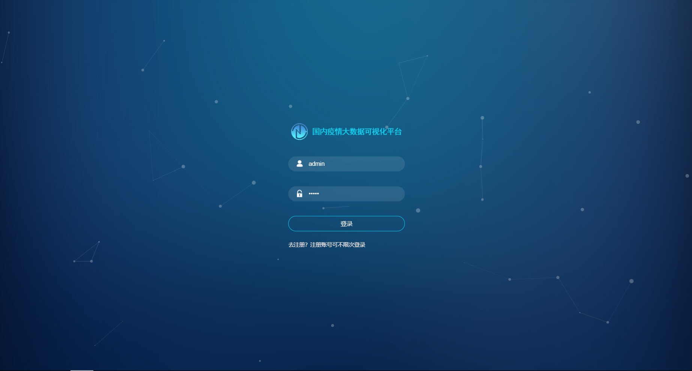

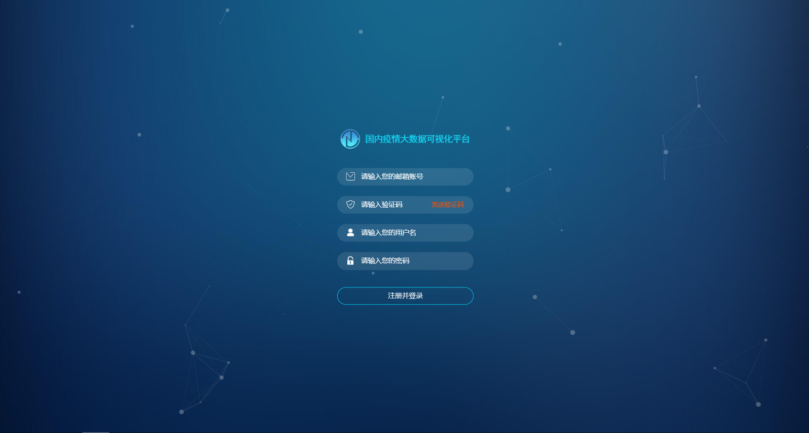

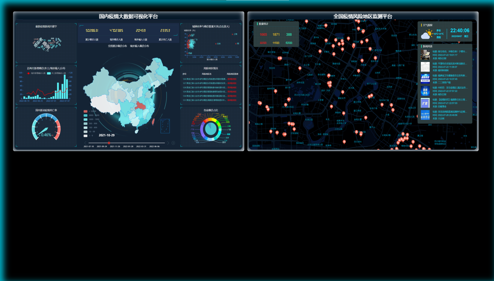

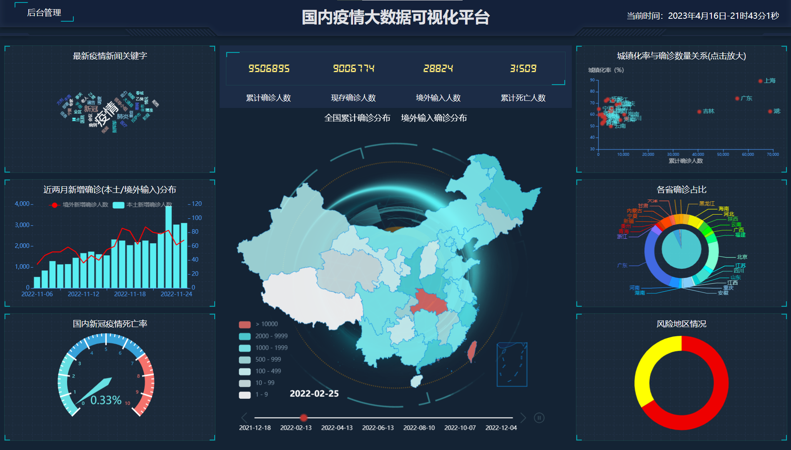

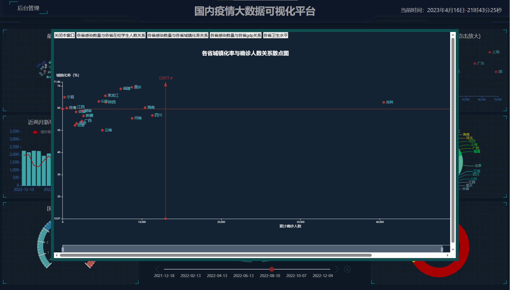

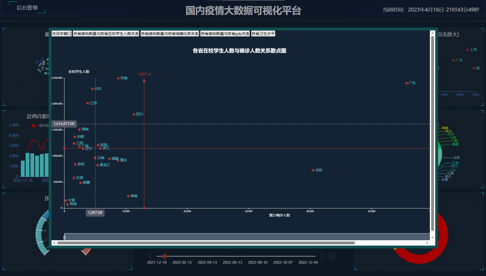

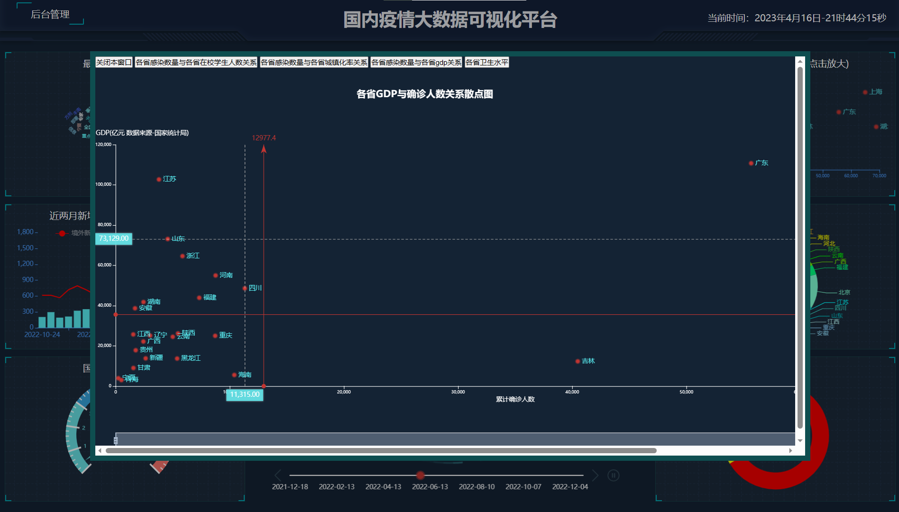

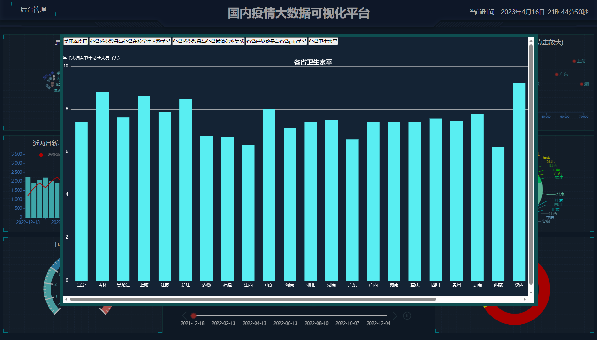

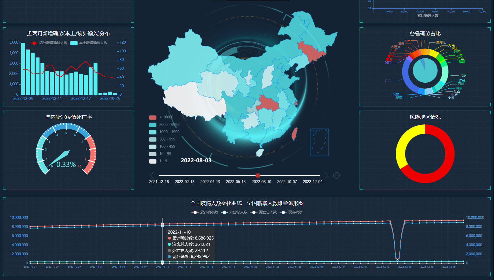


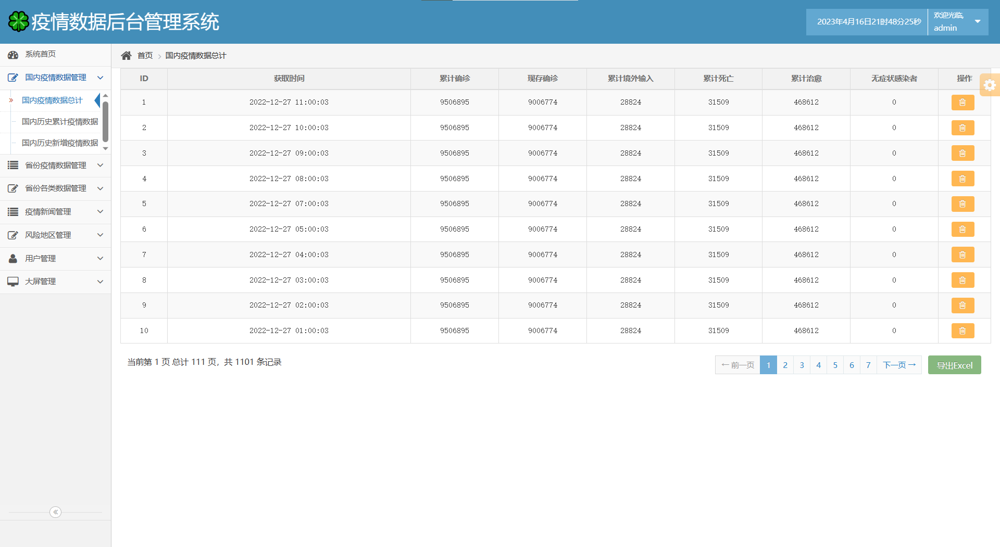

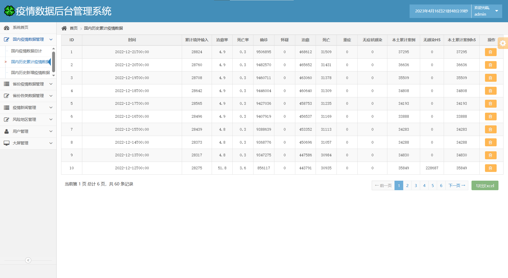


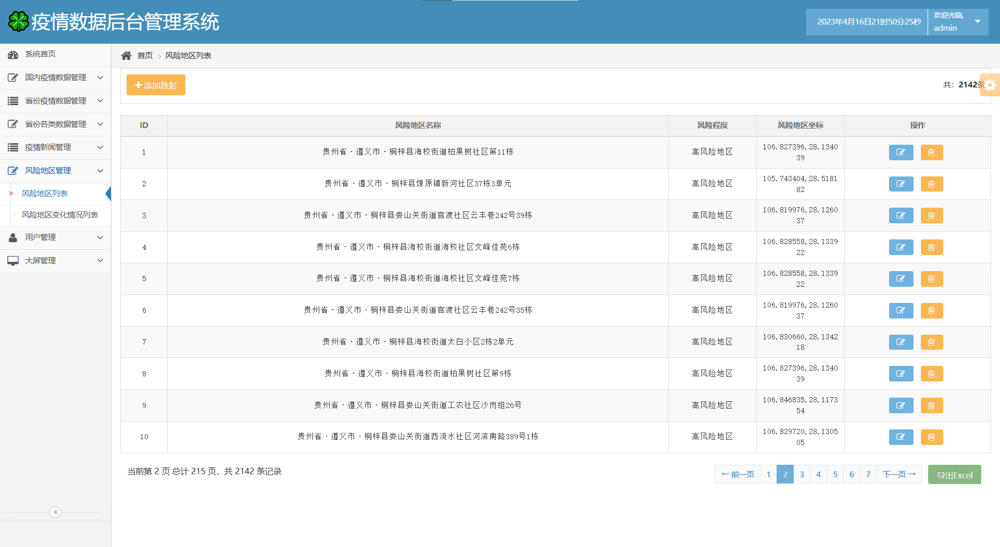


## 后续打算

1.  👨‍⚕️疫情数据后台管理：新增爬虫脚本信息。
2.  👩‍⚕️加入Redis技术：优化可视化大屏查询数据时间以及登录注册发送邮箱验证码时间限制。
3.  👨‍🎓增加kafka技术：将爬取到的数据写入kafka之后，再去消费数据，无论是将数据清洗之后存入数据库中或者是将数据拿出来进行一些监测。
4.  👨‍🎓定时任务优化：将crontab定时任务写在java代码里面。

目前由于本人的时间有限并且新冠疫情已经开放解封了导致数据不再更新维护。这些打算就不再做了，大家要是有兴趣的话可以自己做一下试试看。